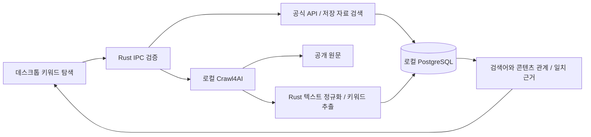

# 키워드 탐색

Opal 탐색을 앱의 **키워드 탐색**으로 교체합니다. 키워드를 입력해 콘텐츠를 찾고, 콘텐츠를 선택해 어떤 검색어에서 발견됐는지와 제목·설명·본문의 추출 단어를 함께 확인하는 로컬 작업실입니다. 기존 Opal 설정·DB 이력은 삭제하지 않으며 새 화면에서 Google/Aside 세션을 실행하지 않습니다.

## 화면과 사용 흐름

1. **저장 자료 검색**에서는 기존 수집 콘텐츠를 검색합니다. 검색어가 없으면 최신 자료를 표시하며, YouTube·네이버 블로그·Google Trends 소스 필터를 적용할 수 있습니다.
2. **공식 소스 수집**에서는 입력한 검색어를 선택한 소스에 전달하고 결과와 검색 이력을 DB에 저장합니다. YouTube와 네이버는 저장한 수집 API 설정을 사용합니다. Google Trends는 한국 트렌드 RSS의 주제 필터이며 Google 웹 검색 결과가 아닙니다.
3. 결과 카드에는 제목·설명·출처·수집 시각과 일치한 필드를 표시합니다. YouTube는 앱의 제한된 로컬 플레이어로 영상을 열고, 블로그·웹 문서는 텍스트 미리보기와 원문 링크를 제공합니다.
4. 콘텐츠를 선택하면 **이 검색어로 발견됨**, **원문에서 추출한 단어**, **기존 수집 주제**를 구분해 표시합니다. 키워드를 누르면 해당 단어로 저장 자료를 다시 검색합니다.
5. **로컬 크롤러 시작**으로 Crawl4AI 컨테이너를 준비합니다. 선택한 콘텐츠 한 건을 원문 수집하면 본문과 추출 단어를 DB에 저장합니다. 컨테이너 다운로드에는 인터넷과 OrbStack/Docker가 필요합니다.
6. 최근 검색 이력에서 검색어·소스·시각·응답 콘텐츠를 다시 확인할 수 있습니다. 오류·빈 결과·DB 미연결·취소 상태를 화면에 표시합니다.

결과 번호는 이 앱이 수집·정렬한 소스별 목록의 순서입니다. SEO 순위·SNS 추천 알고리즘 순위·전체 검색량·유입 통계로 해석하지 않습니다. 기존 `social_trends.keyword`는 영상 제목이나 수집 주제인 경우가 있어 실제 검색어의 증거로 사용하지 않습니다. 새 YouTube·네이버 공식 검색부터 검색어와 반환 URL의 관계를 별도 관측 이력으로 남깁니다. Google RSS 필터 실행은 검색 이력으로 보관하되 실제 API 검색어 관측으로 만들지 않습니다.

## 처리 구조

검색·입력 검증·소스 선택·텍스트 분석·DB 저장·취소·업데이트와의 동시 실행 제한은 Rust에서 처리합니다. 화면은 React/Tauri이며 Next.js 서버가 필요하지 않습니다. Crawl4AI의 공개 웹 렌더링 엔진은 공식 Python/Chromium 컨테이너를 사용합니다.

## 데이터와 알고리즘

`006_keyword_explorer.sql`을 기존 DB에 추가합니다.

| 데이터 | 용도 |
| --- | --- |
| `social_trends` | 기존 콘텐츠와 최신 공식 수집 결과 |
| `keyword_search_runs` | 입력 검색어·소스·시각·결과 목록 |
| `keyword_search_observations` | YouTube·네이버 검색과 반환 콘텐츠 URL의 관계·소스별 수집 결과 순서 |
| `keyword_documents` | 원문 URL·크롤러·제목·본문·수집 시각 |

공식 수집은 콘텐츠와 검색 관측을 한 트랜잭션으로 저장합니다. 이력은 추가만 허용하며 앱 계정에 이력 수정·삭제 권한을 주지 않습니다. 기존 채널·콘텐츠·OAuth·Opal 테이블을 비우지 않습니다.

텍스트는 Unicode NFKC와 소문자로 정규화합니다. 한글 어절과 영숫자를 기준으로 단어를 나누고 짧은 단어·숫자·일반 불용어를 제외합니다. 추출 점수는 제목 가중치, 어절 빈도와 로컬 문서 집합의 TF-IDF 신호로 계산합니다. 형태소 분석·의미 임베딩·검색량 예측 모델은 포함하지 않습니다. 카드의 일치 근거는 제목·설명·기존 수집 주제·본문·실제 검색어 필드를 구분합니다.

저장 자료 검색은 최신 최대 **5,000개 레코드**, 페이지당 최대 **50개**를 사용합니다. 전체 DB 건수와 이 검색 범위는 구분해 표시합니다. 본문은 인덱스에서 앞부분 **3,000자**를 사용하며 원문 수집은 문서당 최대 **50,000자**입니다. 전체 웹 색인이나 콘텐츠의 모든 문장을 검색하는 기능으로 표시하지 않습니다.

## 도입 도구의 역할

현재 기본 원문 엔진은 Crawl4AI이며 다른 도구의 역할과 도입 상태를 아래처럼 구분합니다.

| 프로젝트 | 역할 | 현재 적용 상태 |
| --- | --- | --- |
| [Crawl4AI](https://github.com/unclecode/crawl4ai) | 공개 페이지 JS 렌더링·Markdown 추출 | 고정 버전 로컬 컨테이너와 Rust 어댑터 |
| [Firecrawl](https://github.com/firecrawl/firecrawl) | 웹 scrape/search와 구조화 데이터 | 선택적 어댑터 경계. 자체 호스팅의 인증·외부 요청 제약 검증 전에는 실행 비활성화 |
| [browser-use](https://github.com/browser-use/browser-use) | 여러 단계의 브라우저 작업 | 향후 사용자 승인 작업 경로. 기본 키워드 검색에는 사용하지 않음 |
| [Crawlee](https://github.com/apify/crawlee) | 대규모 큐·재시도·동시 수집 | 향후 배치 수집 확장 후보 |
| [Scrapy](https://github.com/scrapy/scrapy) | 도메인별 정형 수집 | 향후 전용 수집기 후보 |
| [MarkItDown](https://github.com/microsoft/markitdown) | PDF·Office 문서의 Markdown 변환 | 향후 문서 가져오기 경로 |
| [Scrapling](https://github.com/D4Vinci/Scrapling) | 페이지 추출·선택자 처리 | 향후 소스별 추출기 후보 |
| [scrcpy](https://github.com/Genymobile/scrcpy) | 실제 Android 기기 화면·제어 | 모바일 작업에 별도 사용. 웹 키워드 엔진에는 연결하지 않음 |
| [AutoScraper](https://github.com/alirezamika/autoscraper) | 예시 기반 추출 패턴 | 향후 선택자 학습 후보 |
| [curl-impersonate](https://github.com/lwthiker/curl-impersonate) | HTTP 요청 호환성 | 기본 수집에 사용하지 않음 |

실시간 소스 범위는 YouTube Data API, 네이버 검색 API, Google Trends RSS입니다. Threads·TikTok·Instagram 검색 수집, 웹 전체 검색 및 로그인 세션을 사용하는 수집은 이 기능에 포함하지 않습니다. 네이버 검색 API는 개발자센터의 검색 권한 활성화도 필요합니다. Crawl4AI 자체 호스팅은 공개 URL을 읽는 엔진이며 범용 웹 검색 API를 제공하지 않습니다. [Crawl4AI 자체 호스팅 안내](https://docs.crawl4ai.com/core/self-hosting/), [Firecrawl Rust 계약](https://docs.firecrawl.dev/agent-source-of-truth/rust)

## 로컬 운영과 보안

컨테이너 실행 자료는 앱 설정 디렉터리의 `crawler-stack`에 복사합니다. Compose 원본은 [infrastructure/keyword-crawler](../infrastructure/keyword-crawler/)에 있고 API 토큰은 런타임 `.env.crawler.local`에만 생성합니다. 토큰을 로그·화면·공개 소스에 넣지 않습니다. PostgreSQL 스택과 데이터 볼륨은 별개입니다.

- API는 `127.0.0.1:11235`에만 열고 `/health`를 제외한 수집 요청에는 토큰을 사용합니다.
- 공식 Crawl4AI 0.9.4 이미지를 manifest digest로 고정합니다. 컨테이너는 읽기 전용·비관리자·권한 제한과 메모리/프로세스 제한을 적용하며 호스트·Docker 소켓·사용자 파일을 마운트하지 않습니다.
- Rust는 저장된 콘텐츠의 공개 HTTPS URL만 전달합니다. 로컬·사설 주소와 URL 안의 인증 정보를 거부합니다. 리디렉션·DNS 변경에 대한 차단은 공식 컨테이너의 egress broker를 유지하며 내부 URL 허용 옵션을 켜지 않습니다.
- 대상 페이지에는 DB·SNS·OAuth 비밀값을 전달하지 않습니다. HTML을 앱 DOM에 삽입하지 않으며 Markdown도 텍스트로 표시합니다.
- 본문 수집 실패 시 기존 콘텐츠와 검색 이력을 유지합니다. 설치·수집 중 업데이트 실행을 제한하고, 취소 이후 부분 수집 결과를 성공으로 기록하지 않습니다.

구현·단위 검사·실제 컨테이너·네이티브 앱·공개 배포의 검증 상태는 [데스크톱 검증 기록](DESKTOP_VALIDATION.md)에 별도로 기록합니다.
