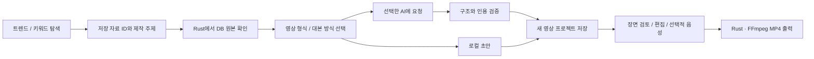

# 트렌드·키워드에서 영상 만들기

## 목표와 사용자 흐름

수집된 자료를 다시 복사하거나 영상 JSON을 직접 작성하지 않고, 앱 안에서 소재 확인부터 영상 출력까지 진행합니다.

1. **트렌드 탐색**, 오버뷰의 수집 자료 또는 **키워드 탐색**에서 콘텐츠를 선택하고 **영상 만들기**를 누릅니다.
2. **영상 스튜디오**에서 저장된 원본의 제목·설명·출처와 제작 주제를 확인합니다. 이전 영상에 저장하지 않은 수정이 있으면 먼저 저장하거나 기존 편집을 유지할 수 있습니다.
3. 쇼츠·세로 영상 또는 YouTube 가로 영상 형식을 선택합니다. 기본 초안은 실제 자료를 사용하는 로컬 처리이며, 연결된 AI를 선택했을 때만 대본 요청을 보냅니다.
4. 생성된 새 프로젝트의 장면·제목·본문·대본·길이를 검토하고 편집합니다. 이전 프로젝트를 덮어쓰지 않습니다.
5. 장면의 음성이 필요하면 기존 로컬 TTS 기능을 사용합니다. 처리 환경을 확인하고 **MP4 출력**으로 Rust·FFmpeg 영상을 생성합니다.

## 칸반 이동

콘텐츠 플래너의 네 상태 열은 한 줄로 유지합니다. 보드 안에서 좌우 스크롤하거나 이동 버튼·키보드를 사용해 다른 상태 열로 이동하고, 각 열에서 위아래로 스크롤해 많은 카드를 확인합니다. 카드 수정·출처 링크·추가 버튼의 기존 동작을 유지하며 화면 전체에 가로 넘침을 만들지 않습니다.

## 처리와 데이터 계약

- 소재는 최대 5개의 저장 자료 ID로 지정합니다. Rust가 ID로 DB를 조회하므로 화면에서 임의의 제목·URL·본문을 보내 원본으로 저장하지 않습니다.
- `video_research_preview`는 소재를 읽어 확인하는 요청이고, `video_create_research_project`는 형식과 대본 방식을 검증해 새 UUID의 영상 프로젝트를 생성·저장합니다.
- 프로젝트의 `research` 정보에는 제작 키워드·주제·출처·수집 시각·실제로 사용한 대본 방식·검토 필요 상태를 남깁니다. 기존 영상 저장소의 필드는 보존합니다.
- 수집된 본문은 비신뢰 자료로 취급합니다. AI 응답은 허용된 구조와 자료 범위에 맞는지 확인하고, 실패 시 로컬 초안을 사용했다는 안내를 표시합니다. AI 성공이나 사실 검증을 대신 주장하지 않습니다.
- 생성 중 업데이트 설치와 영상 렌더를 동시에 진행하지 않도록 Rust의 작업 잠금을 사용합니다. 실패한 요청은 기존 영상 프로젝트를 수정하지 않습니다.

## 현재 출력 범위

생성 영상은 편집 가능한 제목·본문·출처 장면을 FFmpeg로 합성하는 브리핑 영상입니다. 수집된 YouTube 영상을 내려받거나 재사용하지 않습니다. 원본 URL은 출처이며 로컬 미디어 파일로 바뀌지 않습니다. 음성은 연결된 TTS를 사용해 별도로 생성하며, 채널 업로드·게시 여부는 사용자가 결정합니다.

키워드 탐색의 실제 검색어 관측과 본문에서 추출한 단어는 계속 구분합니다. 조회수·검색 결과 순서를 검색량이나 인기도 예측으로 해석하지 않습니다. 소스와 수집 범위는 [키워드 탐색 설계](KEYWORD_EXPLORER.md)를 따릅니다.

검증 결과와 실제 배포·설치 상태는 [데스크톱 검증 기록](DESKTOP_VALIDATION.md)에 남깁니다.
