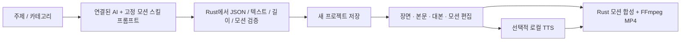

# 주제와 카테고리로 모션 영상 만들기

영상 스튜디오에서 주제와 카테고리만 입력하면 연결된 AI가 제목·장면·화면 본문·내레이션 대본과 모션을 구성합니다. 수집 자료가 없어도 사용할 수 있습니다.

## 제작 흐름

1. 영상 스튜디오의 주제 생성 영역에 주제를 입력하고 카테고리를 선택합니다.
2. **AI로 영상 만들기**를 누릅니다. 기본값은 한국어 쇼츠, 장면 5개, 약 45초이며 연결 가능한 AI를 사용합니다. 상세 옵션에서 제공자·형식·언어·길이·장면 수를 바꿀 수 있습니다.
3. AI가 만든 새 프로젝트에서 제목·본문·내레이션·장면 길이를 편집합니다. 각 장면에 적용된 모션 프리셋과 강도도 바꿀 수 있습니다. 기존 프로젝트에 저장하지 않은 변경이 있다면 먼저 저장하거나 생성을 취소합니다.
4. 원하면 로컬 음성을 생성하고 **MP4 출력**을 누릅니다. 내레이션 대본 생성과 음성 파일 생성은 별도의 단계입니다.

AI가 연결되지 않았거나 결과가 검증에 실패하면 화면에 오류를 표시합니다. 다른 방식의 초안을 AI 결과로 대신 저장하지 않습니다. 주제만으로 만든 내용은 출처 검증이 완료된 자료가 아니므로 게시 전 사실과 표현을 확인합니다.

## 모션 스킬

[toris-video-motion](../skills/toris-video-motion/SKILL.md)은 앱과 에이전트가 함께 사용하는 규칙입니다. AI 기획 프롬프트를 Rust 빌드에 포함하므로 실행 중 외부 사이트에 접속하거나 프롬프트를 내려받지 않습니다. 스킬 자체는 사용자 Codex 스킬 폴더에도 설치할 수 있습니다.

| 프리셋 | 장면 용도 |
|---|---|
| kinetic-title | 첫 장면의 타이틀 등장 |
| stagger-rise | 설명을 순서대로 드러내기 |
| slide-reveal | 새 내용의 측면 등장 |
| focus-pulse | 결론을 천천히 강조하기 |
| parallax-pan | 배경과 전경의 완만한 움직임 |
| orbit-cards | 읽을 수 있는 글자 주변의 장식 카드 움직임 |

프리셋은 Rust가 만든 투명 이미지 레이어와 고정 FFmpeg 필터로 렌더링합니다. AI의 코드·명령·경로·필터 문자열을 실행하지 않습니다. 프리셋 이름과 0~1의 강도만 받습니다. 모션 정보가 없는 기존 프로젝트는 기존 정적 렌더 경로를 유지합니다.

[OpenChamber 쇼릴](https://data.openchamber.dev/opus-5-5-videos/v/himanshutwtxs-2103495232637882858)과 [모션 예시](https://nondev-thinking.web.app/motion/)는 연출을 참고한 자료입니다. 원본 영상이나 예제 코드를 배포물에 포함하지 않습니다. 6개 구현 프리셋의 범위는 [모션 방향](../skills/toris-video-motion/references/motion-directions.md)에 명시합니다.

## 구현 범위

- 카테고리: 교육, 기술, 비즈니스, 라이프스타일, 엔터테인먼트, 뉴스·해설.
- 제공자: 기존 설정의 OpenCodex, TeamClaude, Claude CLI. 인증·모델 허용 목록·로컬 주소 제한을 유지합니다.
- 장면 3~8개, 전체 요청 길이 18~180초, 각 장면 3~30초. 대본 분량과 읽는 시간을 함께 확인합니다.
- 새 프로젝트에 주제·카테고리·실제 제공자·스킬 이름·검토 필요 상태를 저장합니다.
- 형식: 쇼츠·세로 영상·YouTube 가로 영상. UI의 모션 미리보기는 연출 확인용이며 최종 결과는 MP4로 확인합니다.
- 주제 기반 기획과 기존 [수집 자료 기반 기획](RESEARCH_VIDEO.md)을 모두 유지합니다. 원본 영상 다운로드나 SNS 자동 게시를 추가하지 않습니다.
